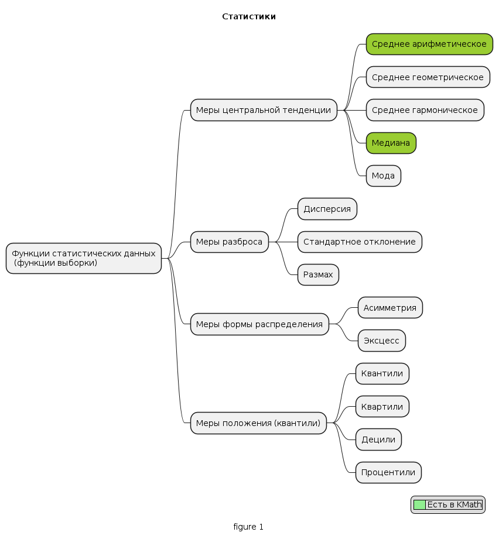
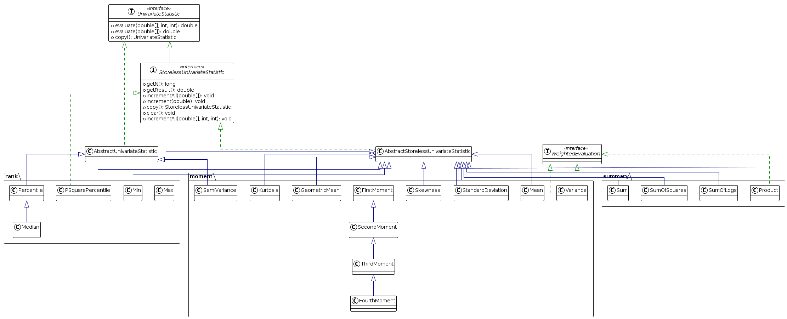

# Расширение статистик для KMath


## Проблема

Значительное число часто используемых статистик (функций статистических данных/функций выборки) отсутствуют в модуле
статистики [kmath-stat ](https://github.com/SciProgCentre/kmath/tree/dev/kmath-stat)
библиотеки [KMath](https://github.com/SciProgCentre/kmath).


### Основные виды статистических показателей. Классификация по категориям.



#### 1. Меры центральной тенденции

* Среднее арифметическое
* Среднее геометрическое
* Среднее гармоническое
* Медиана
* Мода

#### 2. Меры разброса

* Дисперсия
* Стандартное отклонение
* Размах

#### 3. Меры формы распределения

* Асимметрия
* Эксцесс

#### 4. Меры положения (квантили)

* Квантили
* Квартили
* Децили
* Процентили


### Обзор thomasnield/kotlin-statistics

* Основной репозиторий удален. Есть старый репозиторий [springmin/kotlin-statistics](https://github.com/springmin/kotlin-statistics/tree/apache-common-math-refactor)
* Исходник есть в
  maven [kotlin-statistics-1.2.1-sources.jar](https://repo1.maven.org/maven2/org/nield/kotlin-statistics/1.2.1/kotlin-statistics-1.2.1-sources.jar)
* В [статье](https://medium.com/data-science/introduction-to-kotlin-statistics-cdad3be88b5) описан подход. К объектам
  стандартной библиотке, содержащие набор данных `Sequence`, `Iterable`, `IntArray`, `LongArray`, `FloatArray`, `DoubleArray`
  добавляются функции-расширения такие как:
```kotlin
  fun LongArray.geometricMean() = StatUtils.geometricMean(asSequence().map { it.toDouble() }.toList().toDoubleArray() )
  fun LongArray.median() = percentile(50.0)
  fun LongArray.percentile(percentile: Double) = StatUtils.percentile(asSequence().map { it.toDouble() }.toList().toDoubleArray(), percentile)
  fun LongArray.variance() = StatUtils.variance(asSequence().map { it.toDouble() }.toList().toDoubleArray())
  fun LongArray.sumOfSquares() = StatUtils.sumSq(asSequence().map { it.toDouble() }.toList().toDoubleArray())
  fun LongArray.standardDeviation() = descriptiveStatistics.standardDeviation
  fun LongArray.normalize() = StatUtils.normalize(asSequence().map { it.toDouble() }.toList().toDoubleArray())
  val LongArray.kurtosis get() = descriptiveStatistics.kurtosis
  val LongArray.skewness get() = descriptiveStatistics.skewness
 ```  
* В старом репозитории начальная реализация сделана на чистом Kotlin, затем число статистик расширено и использована Apache Commons Math


### Обзор Apache Commons Math

* [javadocs](https://commons.apache.org/proper/commons-math/javadocs/api-3.6.1/org/apache/commons/math3/stat/descriptive/package-summary.html)

#### Пример из javadoc:

**_UnivariateStatistic:_**

```java
/* evaluation approach */
double[] values = new double[] { 1, 2, 3, 4, 5 };
UnivariateStatistic stat = new Mean(); // 1
out.println("mean = " + stat.evaluate(values)); //2
```

**_StorelessUnivariateStatistic_**

```java
/* incremental approach */
double[] values = new double[] { 1, 2, 3, 4, 5 };
StorelessUnivariateStatistic stat = new Mean(); // 1
out.println("mean before adding a value is NaN = " + stat.getResult());
for (int i = 0; i < values.length; i++) {
    stat.increment(values[i]); // 2
    out.println("current mean = " + stat.getResult());
}
stat.clear(); //3
out.println("mean after clear is NaN = " + stat.getResult());
```

#### Диаграмма классов

Неполная, только с классами - статистиками


